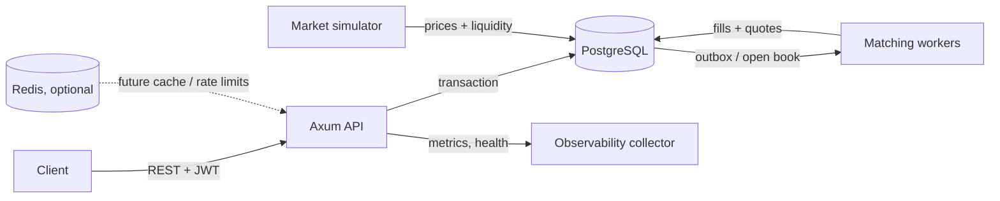

# Dummy Exchange

A production-style, simulated electronic exchange in Rust. Authenticated users receive simulated accounts, trade BTC/USD, ETH/USD, and SOL/USD against deterministic replenishing liquidity, and receive durable fills produced by independently runnable matching workers.

## Architecture



PostgreSQL is authoritative for users, accounts, orders, fills, audit data, and the transactional outbox. A worker takes an advisory lock per instrument, so many workers may run but only one mutates a book at a time. This is intentionally straightforward to operate and preserves deterministic price-time matching. The `fills` unique key makes repeat execution harmless.

## Request and fill flow

1. The API authenticates a JWT, validates the order, and locks/reserves the needed simulated balance in one transaction.
2. It writes the order and `order.accepted` outbox event atomically. Reusing a client order ID returns the original order.
3. A matching worker obtains the instrument lease, locks open orders, price-time matches crossed limit orders, and commits fill records and order states atomically.
4. Consumers can project the outbox into WebSockets/SSE, notifications, or analytics; this vertical slice leaves transport adapters deliberately separate from the matching invariant.

## Local development

Requirements: Rust stable and PostgreSQL 16+; Redis is optional for this vertical slice. Create a database, copy `.env.example` to `.env`, and set its `DATABASE_URL`. The processes load the repository `.env` automatically.

```powershell
Copy-Item .env.example .env
# edit .env with your local PostgreSQL username/password
make migrate
make seed
make run-api
# another terminal
make run-worker
# third terminal
make run-simulator
```

Windows users without `make` can run `cargo run -p exchange-api`, `cargo run -p exchange-worker`, `cargo run -p exchange-simulator`, and `sqlx migrate run --source migrations` directly.

### Local containers

Start the full local stack with Docker Compose:

```powershell
docker compose up --build
```

The API is available at `http://localhost:3000`; Prometheus at `http://localhost:9090`; Grafana at `http://localhost:3001` (local `admin` / `admin`); PostgreSQL and Redis are published on `5432` and `6379` respectively. The Compose credentials and JWT secret are for local development only. See the [monitoring guide](monitoring/README.md) for scraped targets, dashboard, and alerts. Scale matching workers without naming individual containers:

```powershell
docker compose up --scale worker=3
```

### API examples

```bash
curl -X POST http://127.0.0.1:3000/v1/auth/register -H 'content-type: application/json' -d '{"email":"demo@example.test","password":"not-a-real-password"}'
curl -X POST http://127.0.0.1:3000/v1/orders -H "authorization: Bearer $TOKEN" -H 'content-type: application/json' -d '{"client_order_id":"demo-001","instrument":"BTC-USD","side":"buy","order_type":"limit","quantity":"0.01","limit_price":"64000"}'
curl http://127.0.0.1:3000/v1/orders -H "authorization: Bearer $TOKEN"
curl http://127.0.0.1:3000/v1/instruments
curl http://127.0.0.1:3000/v1/markets/BTC-USD/book
```

## Application operations

`GET /healthz` is process liveness, `GET /readyz` verifies database reachability, and `GET /metrics` is Prometheus-compatible. Logs are JSON and HTTP requests receive/propagate `x-request-id`. Configuration is exclusively environment based. OpenTelemetry dependencies are included for exporter wiring by the deployment environment; this repository intentionally contains no observability-stack configuration.

## Decisions and trade-offs

- [Database outbox ADR](docs/adr/0001-database-outbox.md): avoids a broker for one-instrument local development while retaining replay semantics.
- PostgreSQL advisory locks provide horizontal worker safety without a central coordinator. It is a sensible starting point; high-volume multi-instrument deployments can move book ownership to partitioned streams.
- Redis is optional and non-authoritative: suitable later for rate limiting, sessions, cache, and fan-out, never for balances or execution truth.
- Password hashing is deliberately kept minimal in this demo vertical slice and must be replaced with Argon2id before any non-simulated use. JWT signing is symmetric today but the API boundary is OIDC-ready.

## Verification and failure modes

```bash
make test
make lint
make bench BASE_URL=http://127.0.0.1:3000 TOKEN=...
```

Matching invariants are unit tested in the domain crate. The [failure-mode playbook](docs/failure-modes.md) covers restart, duplicate event, dependency loss, and partial-processing drills. Add API-to-database integration tests against an ephemeral PostgreSQL database as the next extension.

## CV highlights

- Rust workspace boundaries that separate exchange rules, public API, and scalable workers.
- Transactional balance reservation, idempotent order submission, price-time priority, and duplicate-fill protection.
- Operationally aware endpoints, structured logs, metrics, migrations, seed data, a benchmark, and explicit reliability trade-offs.

## Deployment assumptions

The deployment environment supplies PostgreSQL, optional Redis, secrets, network ingress, and telemetry collectors. Workers are launched independently with a unique `WORKER_ID` and scaled externally. No container, orchestration, infrastructure, CI/CD, or monitoring-stack artefacts are included by design.

Container and platform implementers should use the detailed [API service](docs/hosting/api-service.md), [matching worker](docs/hosting/matching-worker.md), [market simulator](docs/hosting/market-simulator.md), and [dependency](docs/hosting/dependencies.md) hosting contracts.
