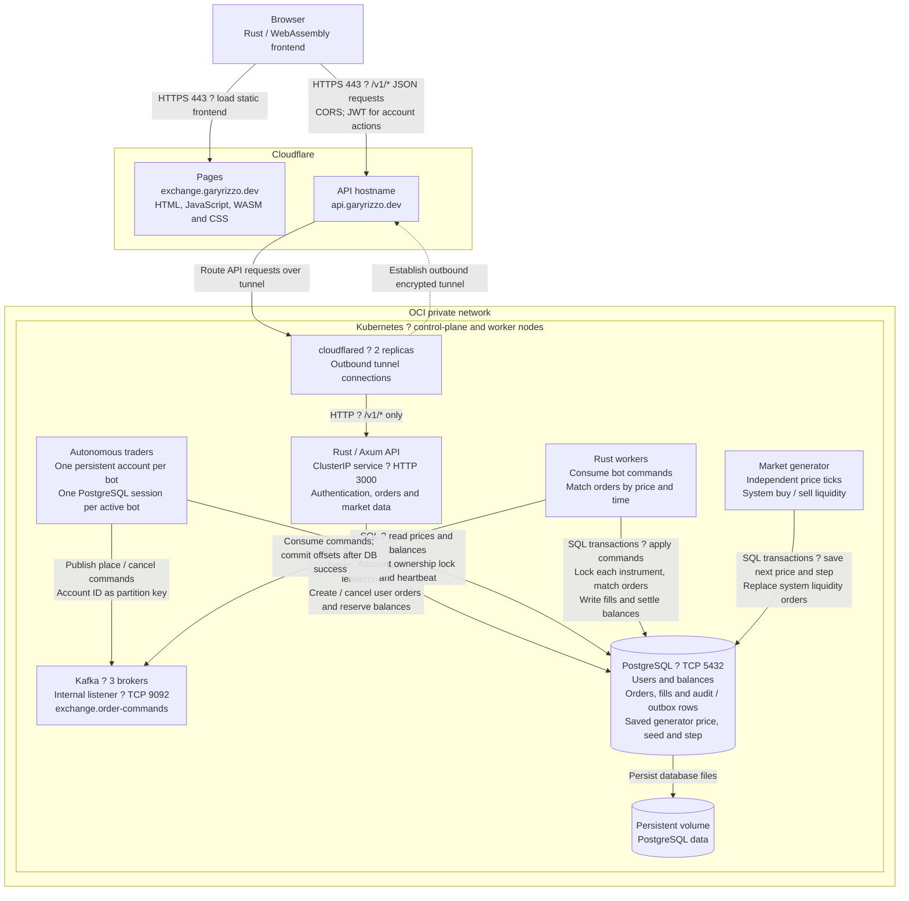
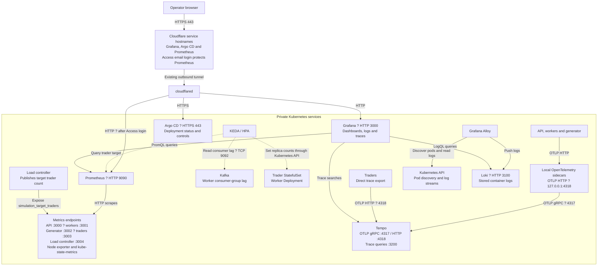
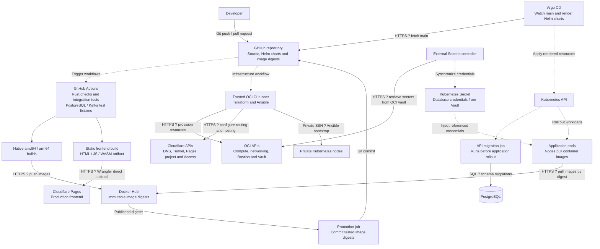

# Traffic flow

These diagrams describe the development deployment. Arrows show who starts a request or sends data; replies return over the same connection. Dashed arrows represent control or deployment traffic.

## Browser and trading traffic

The browser polls the API about every two seconds. Human orders are written directly by the API; bot orders use Kafka. Workers match both from PostgreSQL. Generated prices continue from saved state after a restart. Unmatched tunnel routes return 404.

## Monitoring and scaling traffic

Trader scaling currently stays between 5 and 8 replicas; workers between 1 and 2. The load controller chooses a trader target, while worker scaling follows Kafka lag. Bot accounts remain in PostgreSQL when their pods stop.

## Build, deployment and infrastructure traffic

Terraform manages the Pages project and domain; the frontend workflow uploads the built assets. Argo CD deploys backend image digests from Git. Database migrations run before the application rollout.
