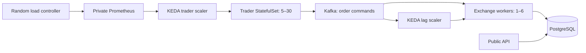

# Kafka and KEDA

Development uses three Strimzi-managed Kafka 4.3.1 brokers, each also a KRaft
controller. Each broker has a persistent 5 GiB volume. The command topic has 12
partitions, replication factor 3, minimum ISR 2 and 24-hour retention, bounded to
128 MiB per partition with 16 MiB segments to fit the 5 GiB broker volumes. Producers
wait for all in-sync replicas. ZooKeeper is not required.

The HTTP API remains synchronous. Traders publish placements and cancellations
instead of calling trading functions directly. Workers check the persistent
trader/account association, validate and reserve balances using the existing
trading transaction, and commit Kafka offsets after database work. Account UUIDs
are Kafka keys, preserving placement/cancellation order for each account.
At-least-once delivery is intentional: client order IDs make retries idempotent
and repeated cancellations cannot refund twice. Invalid payloads and business
rejections are counted and skipped; temporary database/feed errors restart at
the last committed offset. Trace context follows the Kafka command.

Workers also match open orders, including HTTP orders. PostgreSQL advisory locks
still serialize matching per market. Scaling consumers increases command
processing capacity; it does not remove the three-market parallelism limit or
create liquidity. Unfilled limit orders are not Kafka lag: offsets advance when
an order is accepted, rather than waiting for a fill. Workers stay at a minimum
of one to match HTTP orders and resting limits.

KEDA's HPA evaluates lag periodically, targeting 25 queued commands per worker, with
1–6 workers and 120-second scale-down stabilization. Twelve partitions permit
up to twelve active consumers; the configured maximum is six. Two workers are
the fallback after repeated scaler failures. Each worker has a maximum of four
database connections to bound aggregate PostgreSQL demand.

The load controller chooses a random integer between 5 and 30 every 300 seconds
and exposes `simulation_target_traders`. KEDA reads the private Prometheus
service with threshold 1 and scales the trader StatefulSet toward that target.
Missing metrics fall back to five traders. StatefulSet ordinals reuse accounts
in PostgreSQL; scaling down retains balances/history and scaling up does not
top up accounts. Trader scaling is independent of worker lag, avoiding a
feedback loop that generates more orders when processing is already behind.
Adjust bounds/interval under `traders.autoscaling` in `exchange/values.yaml`.

Runtime targets and replica counts are never written to Git. With autoscaling
enabled, charts omit `spec.replicas`; Argo CD ignores replicas for the worker
Deployment and trader StatefulSet and uses `RespectIgnoreDifferences=true`.
Argo still displays live replica counts. Git owns images, resources and scaling
rules; KEDA owns replicas. Default/minikube profiles leave Kafka/KEDA disabled;
development image promotion enables them with compatible binaries.

Kafka has an internal ClusterIP listener only. Strimzi network policies restrict
clients to trader/worker pods and KEDA; no Cloudflare route exists. The dev
client listener is plaintext on the private network; inter-broker traffic uses
Strimzi TLS. Add client TLS/SASL and ACLs before using an untrusted multi-tenant
cluster.

Three brokers run across two Kubernetes nodes with preferred anti-affinity.
Losing the host carrying two brokers loses controller quorum and minimum ISR.
Three separate nodes and replicated storage are required for stronger node
failure tolerance. KEDA scales pods, not OCI nodes. Kafka PVCs use
`deleteClaim: false` and are not automatically pruned.

Grafana's **Kafka and autoscaling** dashboard shows consumer/partition lag,
worker replicas, random targets, trader replicas, throughput and failures.
Application Redis workloads, exporters and settings are removed. Argo CD's own
internal Redis remains because Argo requires it.

Local Kafka: `docker compose -f compose.yaml -f compose.kafka.yaml up --build`.
The overlay starts three brokers and one funded trader. Local traders need
distinct stable `TRADER_ID` values; Kubernetes supplies pod names automatically.

References: [Kafka scaler](https://keda.sh/docs/2.21/scalers/apache-kafka/),
[Prometheus scaler](https://keda.sh/docs/2.21/scalers/prometheus/) and
[Strimzi](https://strimzi.io/docs/operators/1.2.0/deploying.html).
